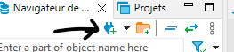
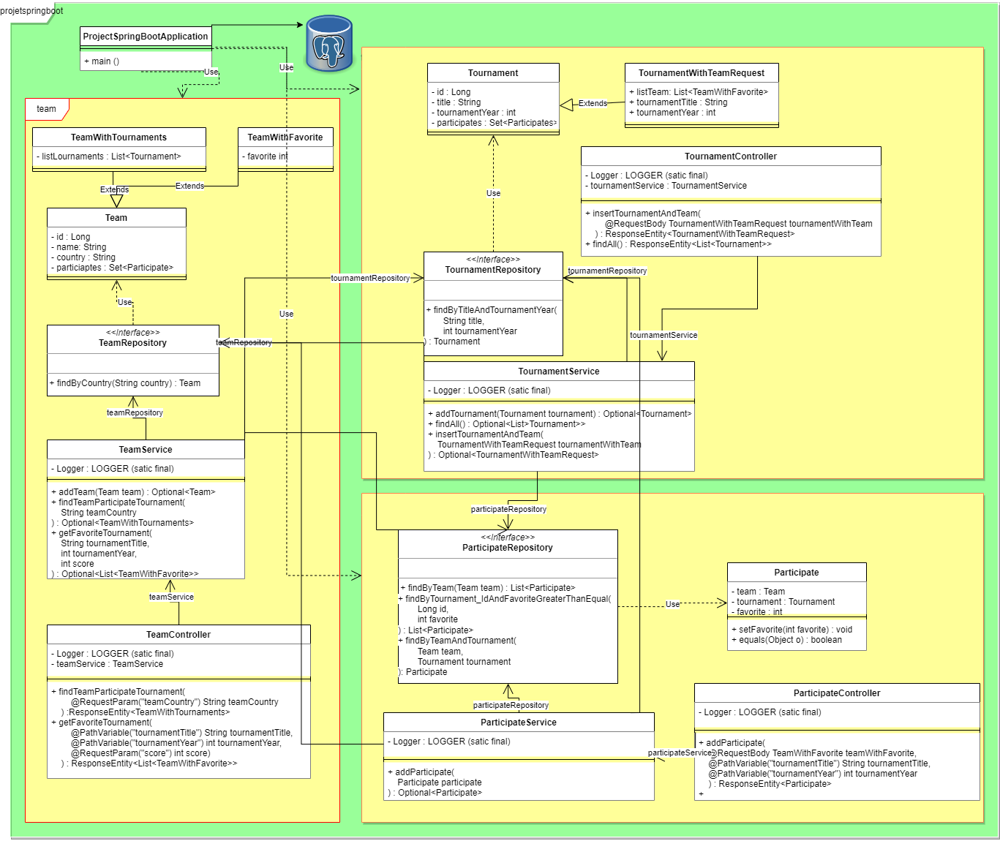

# Initialization of the project

## Working with postgres locally

- Need to download postgresql : https://www.enterprisedb.com/downloads/postgres-postgresql-downloads
- Open the application `SQL SHELL` installed by postgresql :
    - Press `ENTER` four times
    - When you see `Password for user postgres` type your `password` defined during the installation of postgres
    - Execute the command line : `CREATE DATABASE mydatabase;`
- In `application.properties` change values of :
    - `spring.datasource.url` with `jdbc:postgresql://localhost:DB_PORT/NAME_OF_YOUR_DB` in our situation :
        - `DB_PORT` = `5432` if you have no change the configuration during the installation of postgres
        - `NAME_OF_YOUR_DB` = `mydatabase`
    - `spring.datasource.password` with `YOUR_PASSWORD` defined during the installation of postgres

## Working with postgres on Docker

### Pre-requisits
- Docker / Docker-Desktop

### Steps

- Create a docker network : `docker network create db`
- Next you'll want to create a volume for the database data : 
  - Create a directory on your local machine
  - CD into the created directory then run directory : 
    - On Mac/Linux `docker run --name db -p 5432:5432 -e POSTGRES_PASSWORD=password -v $(pwd):/var/lib/postgresql/data -d postgres:latest`
    - On Windows `docker run --name db -p 5432:5432 -e POSTGRES_PASSWORD=password -v %cd%:/var/lib/postgresql/data -d postgres:latest`
- Connecting to the database via psql: `docker run -it --rm --network=db postgres:latest psql -h db -U postgres`
- Enter your password
- Create a database : `CREATE DATABASE mydatabase;`

Once this is done you can connect to the database via your IDE, via psql or DBeaver .

# DBeaver (DBMS)
For see your database on screen :
- Download DBeaver : https://dbeaver.io
  - In DBeaver :
  - Click on `new conection` 
  - Choose `PostgreSQL` then `next`:
    - `Host` : `localhost`
    - `Port` : default `5432`, if you have change the port write the right port
    - `Database` : `NAME_OF_YOUR_DB` in our situation it's `mydatabase`
    - `Password` : `YOUR_PASSWORD` defined during the installation of postgres

# Initialization of the database
Open the file `initDatabase.sql` and execute the queries.

# Our endpoints
## GET
- get all tournaments where the team participate : `localhost:PORT/api/team/tournaments&teamCountry=stringValue`
- get all team who has a favorite greater or equal the score given : `localhost:PORT/api/team/favorites/{tournamentTitle}/{tournamentYear}?score=intValue`
- get all tournaments without team : `localhost:PORT/api/tournament/findAll`
## PUT
- insert in participate table : `localhost:PORT/api/participate/insert/{tournamentTitle}/{tournamentYear}`
  - need body like :  
```json
{"name": "name1" , "country": "country1", "favorite": 4}
```
- insert one tournament with it teams : `localhost:PORT/api/tournament/insert`
  - need body like : 
```json
{
  "title": "competition",
  "tournamentYear": 2000,
  "listTeam": [
    {
      "name": "name1",
      "country": "country1",
      "favorite": 4
    },
    {
      "name": "name1",
      "country": "country2",
      "favorite": 1
    },
    {
      "name": "name1",
      "country": "country3",
      "favorite": 3
    }
  ]
}
```
# UML
# Class
